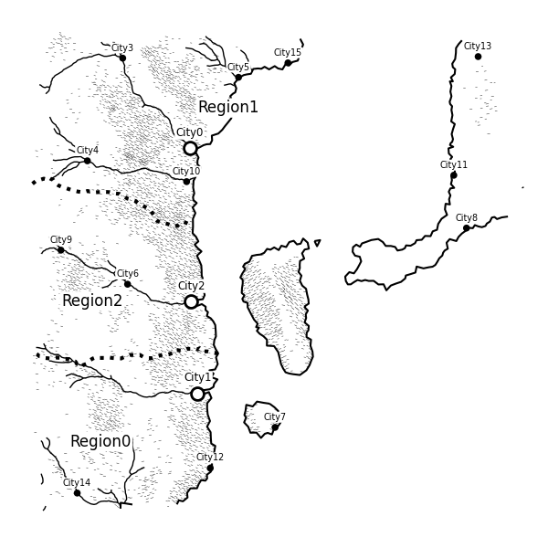
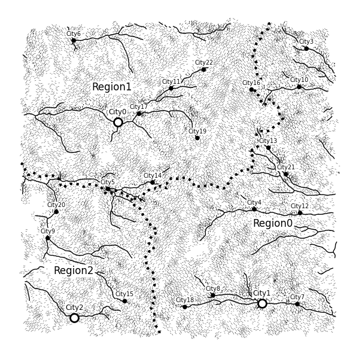
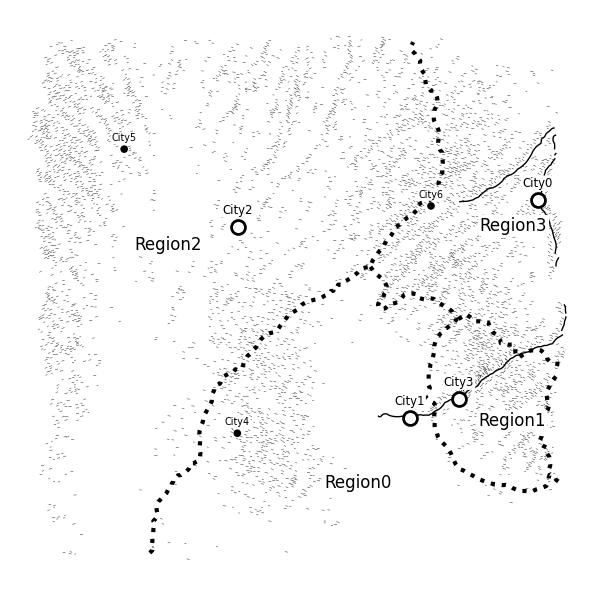
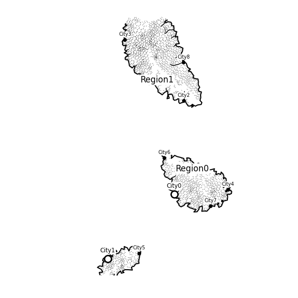

# Procedual Map Generation

## Description
This code is based on Martin O'Leary's [Generating fantasy maps](http://mewo2.com/notes/terrain/). 
There is a well structured [JavaScript implementation](https://github.com/mewo2/terrain), 
but the original project is written in Python, which can be found [here](https://github.com/mewo2/terrain).
I decided to learn some procedural generation stuffs by figuring out how the original Python code works.
During the process I restructured and rewrite the code to be this codebase.

Note that this is not a complete refactor as it would take too much time and effort.
## Usage
To run the code, first install its dependencies
```
pip install scipy
pip install matplotlib
pip install noise
```
The entry point of the code is the ***main.py***

## Outputs
<p align="center"> 
    <br>
    Shore
</p><p align="center"> 
    <br>
    Mountain
</p><p align="center"> 
    <br>
    Desert
</p>
<p align="center"> 
    <br>
    Island
</p>
